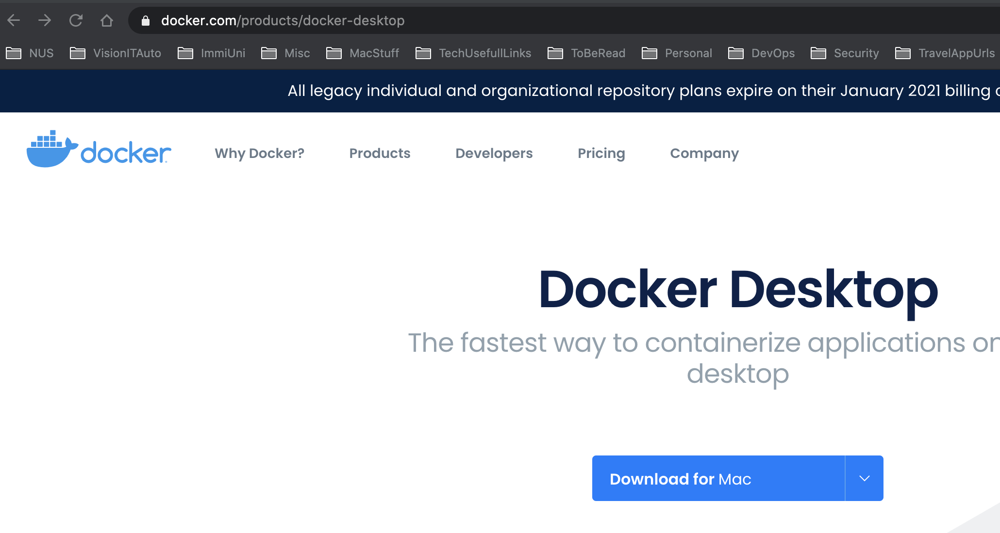
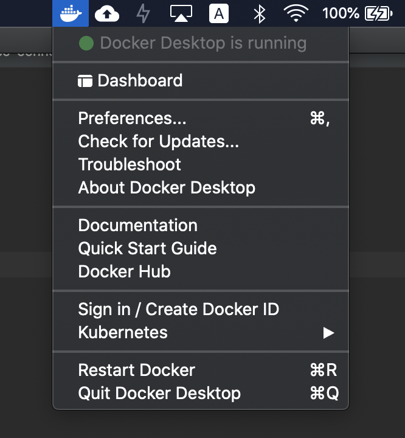
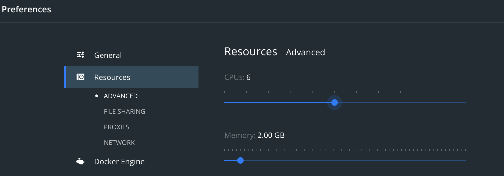
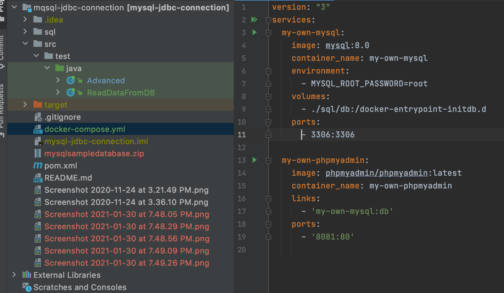
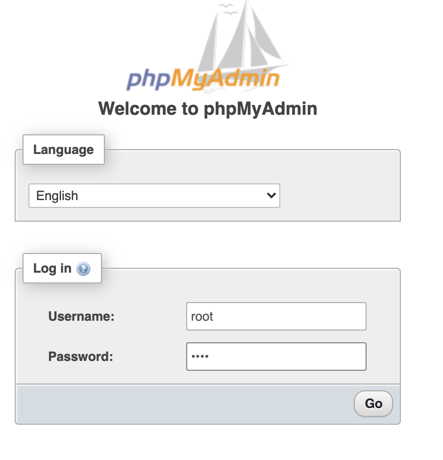
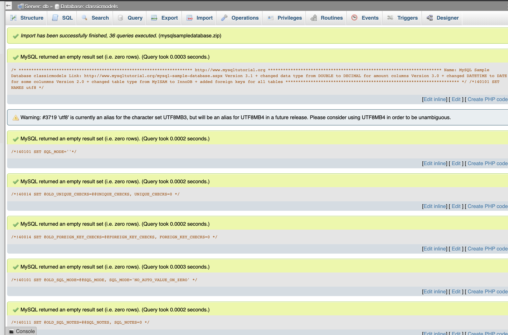
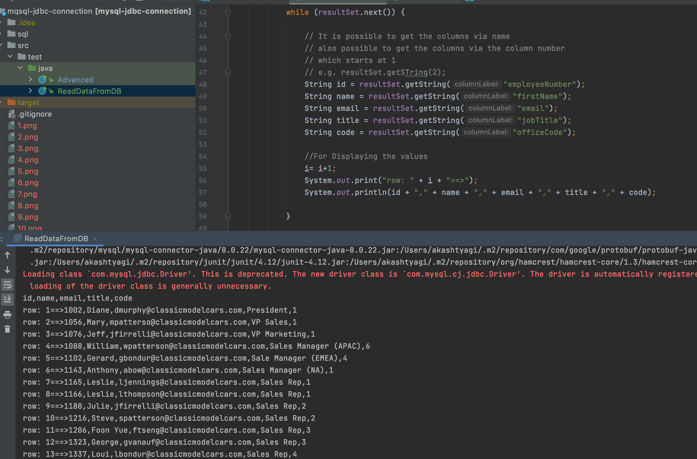

## MySQL - JDBC Connection

To test the connections we need to have MySQL database in place. There are many ways to do it but simplest of all is using Docker.
This tutorial uses latest My SQL Docker image and PHP My Admin to test the java-mq sql connection.

---
### Steps:

---

### Data Base connection Logical Diagram: 
> 

* All the files mentioned in below screen shots is located in the same git hub repo:
* https://github.com/VisionITTesting/mysql-jdbc-connection

* Docker-Compose File:

```yaml

# Create by Akash Tyagi:
# Date: Jan-2021
# Descp: This compose file can be used to set up temp data base with php my admin for DB UI.
# To run this file, go to the root directory of this file:
  # 1. "docker-compose up"
# To Stop the execution: first press the
  # 2. press "cntrl+c" and then run the command:
  # 3. "docker-compose down --remove-orphans"

version: "3"
services:
  my-own-mysql:
    image: mysql:8.0
    container_name: my-own-mysql
    environment:
      - MYSQL_ROOT_PASSWORD=root
    volumes:
      - ./sql/db:/docker-entrypoint-initdb.d
    ports:
      - 3306:3306

  my-own-phpmyadmin:
    image: phpmyadmin/phpmyadmin:latest
    container_name: my-own-phpmyadmin
    links:
      - 'my-own-mysql:db'
    ports:
      - '8081:80'

```

* Java Code to connect to the DB:

```java

// Adapted from http://www.vogella.com/tutorials/MySQLJava/article.html

import java.sql.*;
import java.util.Date;

public class ReadDataFromDB {

    private Connection connect = null;
    private Statement statement = null;
    private ResultSet resultSet = null;

    final private String host = "localhost:3306";
    final private String user = "root";
    final private String passwd = "root";


    public static void main(String[] args) throws Exception{
        ReadDataFromDB obj = new ReadDataFromDB();
        String query="SELECT * FROM `employees` WHERE 1";
        obj.readDataFromDB(query);
    }

    public void readDataFromDB(String query) throws Exception {
        try {
            // This will load the MySQL driver, each DB has its own driver
            Class.forName("com.mysql.jdbc.Driver");

            // Setup the connection with the DB
            connect = DriverManager
                    .getConnection("jdbc:mysql://" + host + "/classicmodels?"
                            + "user=" + user + "&password=" + passwd );

            // Statements allow to issue SQL queries to the database
            statement = connect.createStatement();
            // Result set get the result of the SQL query
            resultSet = statement
                    .executeQuery(query);
            System.out.println("id,name,email,title,code");
            int i=0;
            // ResultSet is initially before the first data set
            while (resultSet.next()) {

                // It is possible to get the columns via name
                // also possible to get the columns via the column number
                // which starts at 1
                // e.g. resultSet.getSTring(2);
                String id = resultSet.getString("employeeNumber");
                String name = resultSet.getString("firstName");
                String email = resultSet.getString("email");
                String title = resultSet.getString("jobTitle");
                String code = resultSet.getString("officeCode");

                //For Displaying the values
                i= i+1;
                System.out.print("row: " + i + "==>");
                System.out.println(id + "," + name + "," + email + "," + title + "," + code);

            }

        } catch (Exception e) {
            throw e;
        } finally {
            close();
        }

    }

    // You need to close the resultSet
    private void close() {
        try {
            if (resultSet != null) {
                resultSet.close();
            }

            if (statement != null) {
                statement.close();
            }

            if (connect != null) {
                connect.close();
            }
        } catch (Exception e) {

        }
    }

}
```

* Maven Dependency:

```xml

  <dependency>
      <groupId>mysql</groupId>
      <artifactId>mysql-connector-java</artifactId>
      <version>8.0.22</version>
  </dependency>
```


### Local Database Env Set Up to Test

* First you need to install Docker-Desktop. To install Docker follow below link:
 [Docker-Desktop](https://www.docker.com/products/docker-desktop)
 
* Once docker is installed, go to Docker-Desktop settings and increase the memory to at least 2 GB (more the better, if you have 8 GB RAM, then give 4 GB).

> 

> 

> 

> 

> 

> 

> 

> 

> 

> 

> 

> 

> 

> 

> 

> 

> 

> 

> 

> 

> 


